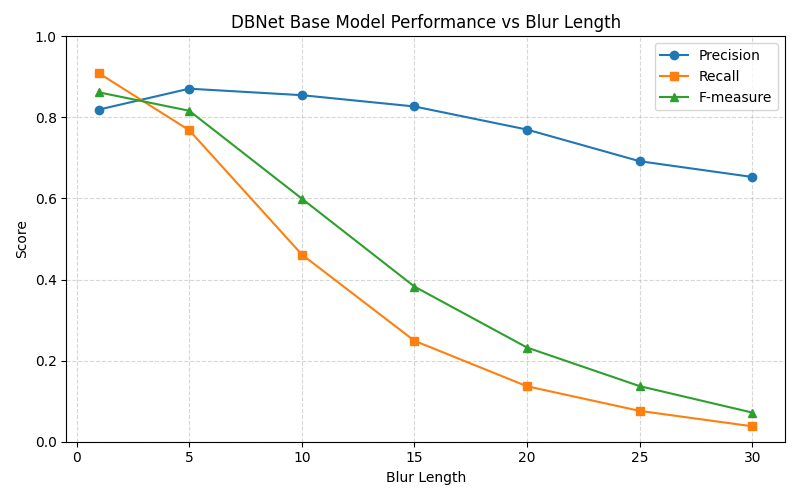
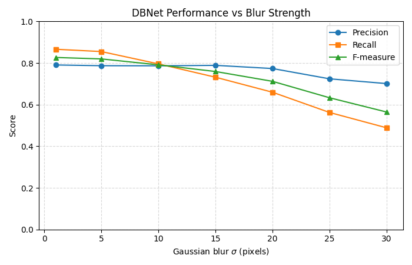

## Real-Time Text Detection Under Motion Blur

Built and evaluated a real time live text detection model for blurred video frames with DBNet and DINOv2 as base architectures. Designed and trained on a gamma-aware motion blur augmentation pipeline, compared pixel-level and IoU-based performance, and measured deployment-oriented FPS.

- **Key results:** Achieved over 50% absolute improvement in F1 score over baseline for the highest blur level while remaining stable across conditions. Maintained over 49 FPS for realtime deployment.
- **Focus:** Real-time robustness under motion blur
- **Tools:** PyTorch, OpenCV, ICDAR2015
- [Project Repo](https://github.com/midoppal/DBNet-Blurred-Text-Detector)
- [Paper](./assets/papers/Realtime_Live_Text_Detection.pdf)

  
  

<!-- 

  
    
  
  
    
  

 -->

## Pneumothorax Classification with LLaVA-Med and PEFT

Fine-tuned multimodal medical models using LoRA and adapter-based methods for chest X-ray classification, with emphasis on reproducible evaluation and lightweight adaptation.

- **Focus:** PEFT for medical vision-language models
- [Project Repo](https://github.com/yourusername/yourrepo)

## Graph Neural Networks for Hyperparameter Inference in Ising Solvers

Worked on graph-based learning methods for solver/hyperparameter selection, contributing to a workshop publication.

- [Publication](./papers)
